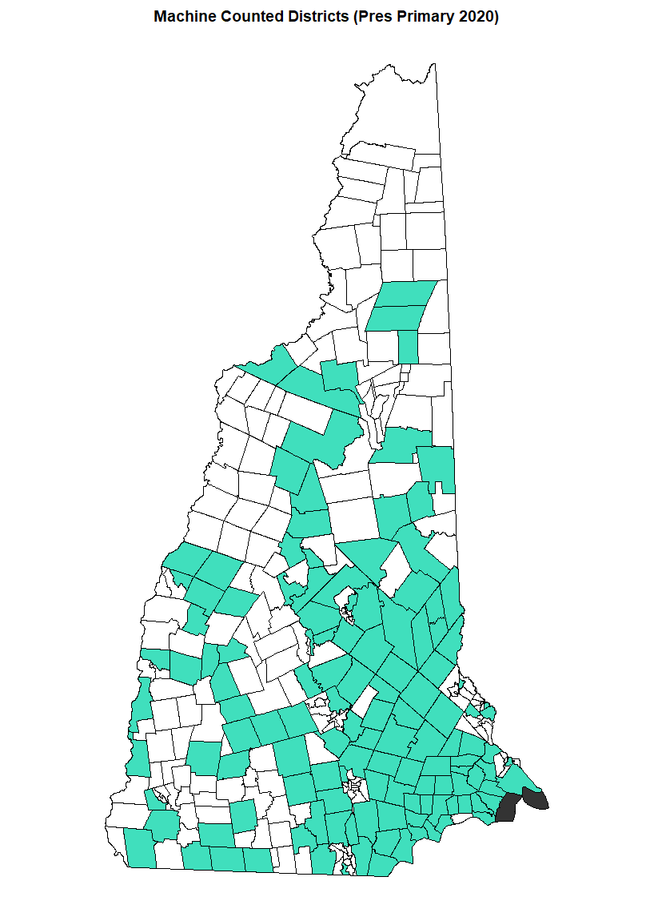

# Analysis of NH Primary Results

Data from [New Hampshire Secretary of State](https://sos.nh.gov/20PresPrimaryDem.aspx)

So far just some basic data transformation to get from XLS to tidy format.

## Machine Counted Districts

## Overview Results

So far, the top analysis shows that Buttigeig did well in townships that used machine counting.  

|candidate    | machine| votes|  total|percent |
|:------------|-------:|-----:|------:|:-------|
|Biden, d     |       0|  9301| 109814|8.5%    |
|Biden, d     |       1| 15610| 182555|8.6%    |
|Buttigieg, d |       0| 25004| 109814|22.8%   |
|Buttigieg, d |       1| 47441| 182555|26.0%   |
|Klobuchar, d |       0| 20887| 109814|19.0%   |
|Klobuchar, d |       1| 37887| 182555|20.8%   |
|Sanders, d   |       0| 31793| 109814|29.0%   |
|Sanders, d   |       1| 44562| 182555|24.4%   |
|Warren, d    |       0| 10828| 109814|9.9%    |
|Warren, d    |       1| 16600| 182555|9.1%    |

Obviously the depends on lots of factors such as placement and demographics.  More analysis will be coming.

## County by County Look

A more detailed breakdown by county.

|candidate    |county              |hand_count |machine_count |difference |
|:------------|:-------------------|:----------|:-------------|:----------|
|Biden, d     |BELKNAP COUNTY      |10.0%      |10.1%         |0.2%       |
|Biden, d     |CARROLL COUNTY      |8.0%       |9.8%          |1.8%       |
|Biden, d     |CHESHIRE COUNTY     |6.2%       |7.5%          |1.3%       |
|Biden, d     |COOS COUNTY         |10.0%      |11.7%         |1.6%       |
|Biden, d     |GRAFTON COUNTY      |7.3%       |6.8%          |-0.5%      |
|Biden, d     |HILLSBOROUGH COUNTY |9.4%       |8.3%          |-1.0%      |
|Biden, d     |MERRIMACK COUNTY    |7.8%       |8.6%          |0.8%       |
|Biden, d     |ROCKINGHAM COUNTY   |9.6%       |9.1%          |-0.5%      |
|Biden, d     |STRAFFORD COUNTY    |8.5%       |6.9%          |-1.6%      |
|Biden, d     |SULLIVAN COUNTY     |7.4%       |9.2%          |1.9%       |
|Buttigieg, d |BELKNAP COUNTY      |24.5%      |25.4%         |0.8%       |
|Buttigieg, d |CARROLL COUNTY      |25.6%      |25.9%         |0.4%       |
|Buttigieg, d |CHESHIRE COUNTY     |21.4%      |21.9%         |0.4%       |
|Buttigieg, d |COOS COUNTY         |20.7%      |21.3%         |0.6%       |
|Buttigieg, d |GRAFTON COUNTY      |23.5%      |24.8%         |1.2%       |
|Buttigieg, d |HILLSBOROUGH COUNTY |22.5%      |26.7%         |4.3%       |
|Buttigieg, d |MERRIMACK COUNTY    |22.7%      |25.6%         |2.9%       |
|Buttigieg, d |ROCKINGHAM COUNTY   |22.9%      |27.5%         |4.5%       |
|Buttigieg, d |STRAFFORD COUNTY    |22.8%      |23.3%         |0.5%       |
|Buttigieg, d |SULLIVAN COUNTY     |25.7%      |24.6%         |-1.2%      |
|Klobuchar, d |BELKNAP COUNTY      |21.1%      |21.6%         |0.5%       |
|Klobuchar, d |CARROLL COUNTY      |25.6%      |21.7%         |-3.9%      |
|Klobuchar, d |CHESHIRE COUNTY     |18.6%      |20.3%         |1.7%       |
|Klobuchar, d |COOS COUNTY         |19.5%      |16.4%         |-3.1%      |
|Klobuchar, d |GRAFTON COUNTY      |19.5%      |17.1%         |-2.4%      |
|Klobuchar, d |HILLSBOROUGH COUNTY |18.1%      |21.9%         |3.9%       |
|Klobuchar, d |MERRIMACK COUNTY    |21.3%      |23.5%         |2.2%       |
|Klobuchar, d |ROCKINGHAM COUNTY   |20.6%      |20.7%         |0.1%       |
|Klobuchar, d |STRAFFORD COUNTY    |17.3%      |18.0%         |0.7%       |
|Klobuchar, d |SULLIVAN COUNTY     |17.6%      |19.8%         |2.2%       |
|Sanders, d   |BELKNAP COUNTY      |24.8%      |23.8%         |-1.0%      |
|Sanders, d   |CARROLL COUNTY      |24.1%      |23.9%         |-0.3%      |
|Sanders, d   |CHESHIRE COUNTY     |33.3%      |29.8%         |-3.4%      |
|Sanders, d   |COOS COUNTY         |30.8%      |29.1%         |-1.8%      |
|Sanders, d   |GRAFTON COUNTY      |27.0%      |27.9%         |0.9%       |
|Sanders, d   |HILLSBOROUGH COUNTY |29.3%      |22.8%         |-6.6%      |
|Sanders, d   |MERRIMACK COUNTY    |27.0%      |22.8%         |-4.1%      |
|Sanders, d   |ROCKINGHAM COUNTY   |25.8%      |22.8%         |-3.0%      |
|Sanders, d   |STRAFFORD COUNTY    |30.4%      |30.5%         |0.1%       |
|Sanders, d   |SULLIVAN COUNTY     |29.5%      |26.2%         |-3.3%      |
|Warren, d    |BELKNAP COUNTY      |8.0%       |7.4%          |-0.6%      |
|Warren, d    |CARROLL COUNTY      |8.7%       |8.2%          |-0.5%      |
|Warren, d    |CHESHIRE COUNTY     |10.4%      |8.7%          |-1.7%      |
|Warren, d    |COOS COUNTY         |7.1%       |8.0%          |0.8%       |
|Warren, d    |GRAFTON COUNTY      |13.8%      |13.8%         |0.0%       |
|Warren, d    |HILLSBOROUGH COUNTY |9.0%       |8.5%          |-0.5%      |
|Warren, d    |MERRIMACK COUNTY    |9.7%       |8.6%          |-1.2%      |
|Warren, d    |ROCKINGHAM COUNTY   |12.2%      |8.6%          |-3.7%      |
|Warren, d    |STRAFFORD COUNTY    |9.9%       |10.3%         |0.4%       |
|Warren, d    |SULLIVAN COUNTY     |9.3%       |9.9%          |0.6%       |
